[security-architecture.md](https://github.com/user-attachments/files/28576294/security-architecture.md)
# Блок-схема SecurityMonitor

Десктопное приложение мониторинга безопасности: сканирование файлов, процессы, сеть. Управление через главный цикл и действия пользователя.

## Общий поток

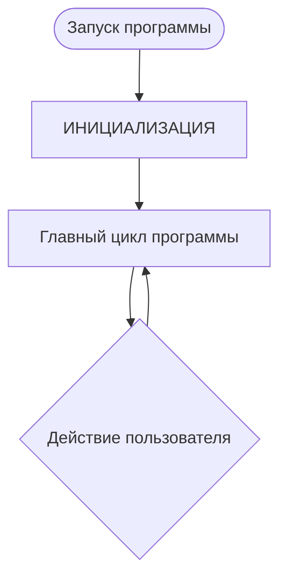

## Инициализация

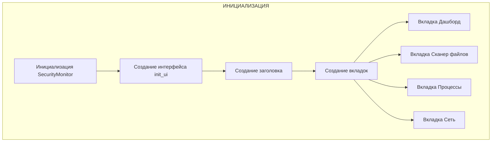

## Действия пользователя

Из главного цикла доступны следующие ветки:

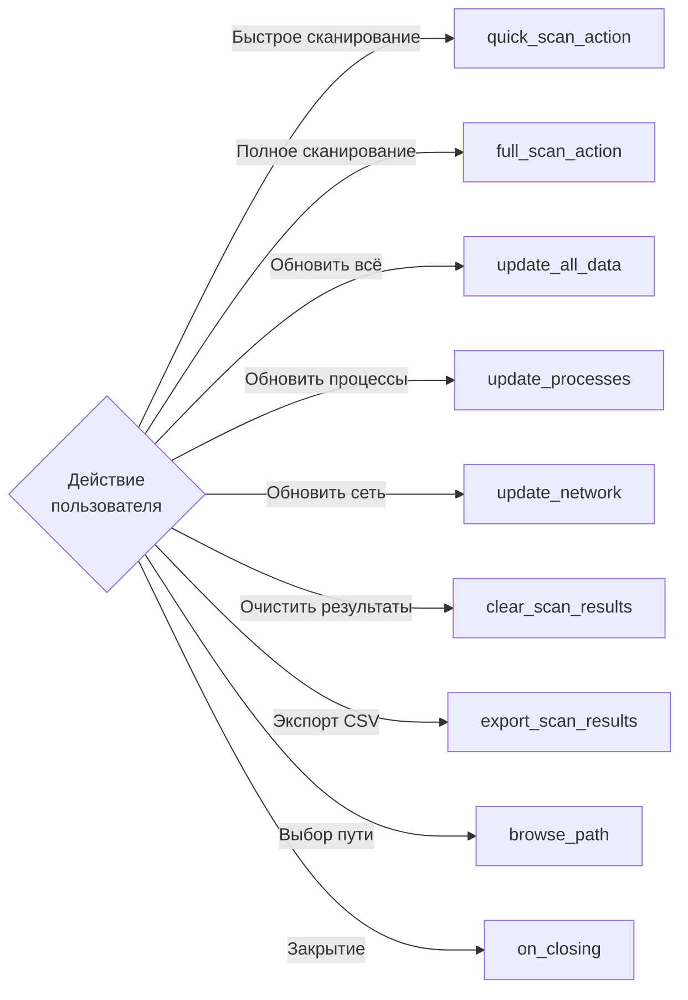

## Сканер файлов — быстрое сканирование

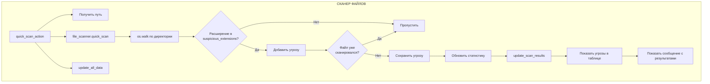

## Сканер файлов — полное сканирование

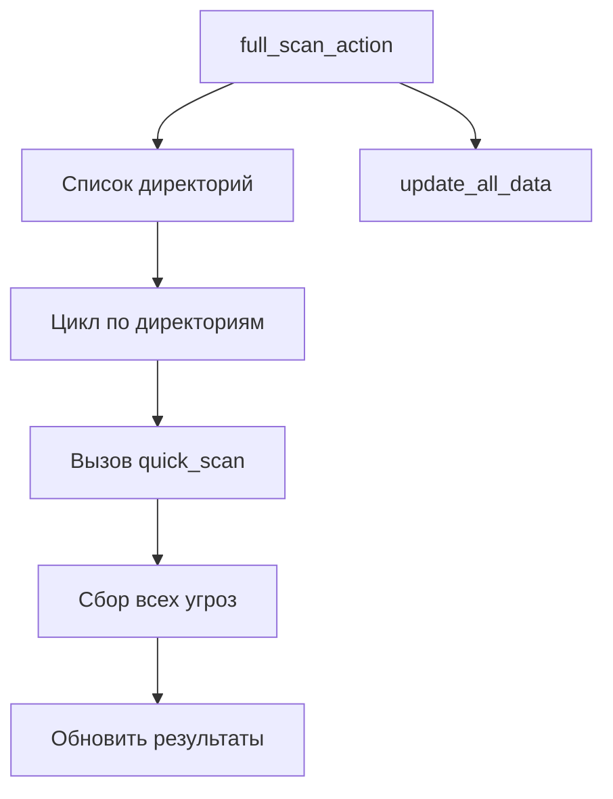

## update_all_data

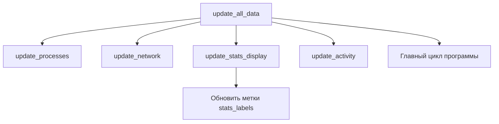

## Монитор процессов

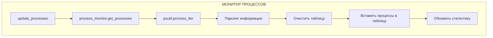

## Сетевой монитор

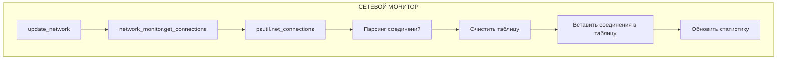

## Экспорт результатов (CSV)

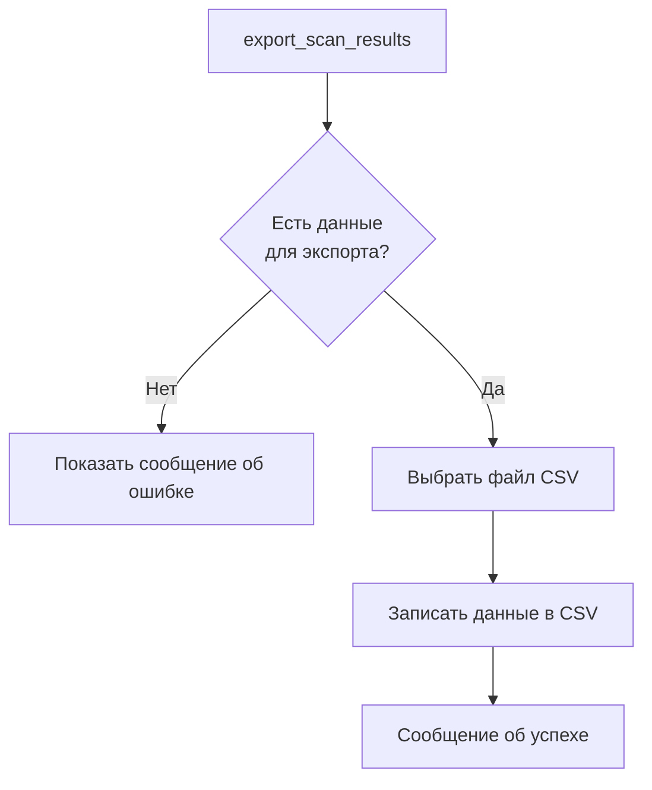

## Очистка результатов

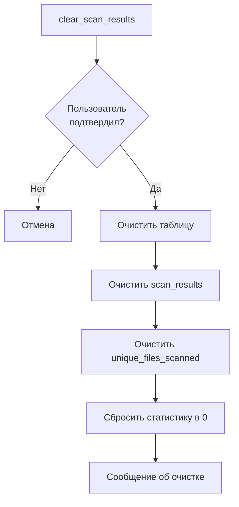

## Прочие действия

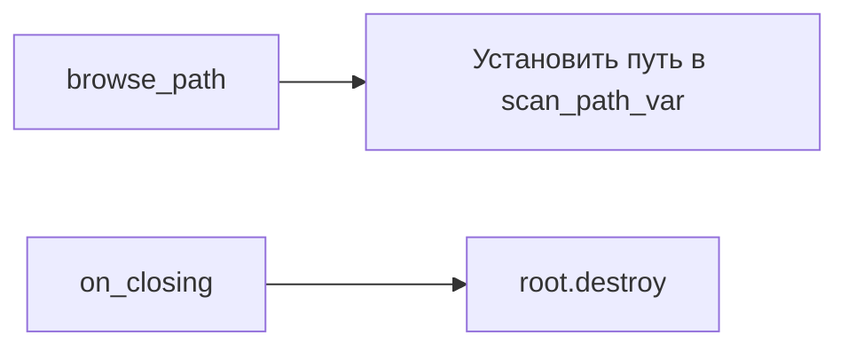

## Модули и функции

| Модуль | Ключевые функции | Зависимости |
|--------|------------------|-------------|
| **Инициализация** | `SecurityMonitor`, `init_ui` | Tkinter |
| **Сканер файлов** | `quick_scan_action`, `full_scan_action`, `file_scanner.quick_scan` | `os.walk`, `suspicious_extensions` |
| **Монитор процессов** | `update_processes`, `process_monitor.get_processes` | `psutil.process_iter` |
| **Сетевой монитор** | `update_network`, `network_monitor.get_connections` | `psutil.net_connections` |
| **Дашборд** | `update_all_data`, `update_stats_display`, `update_activity` | — |
| **Экспорт** | `export_scan_results` | CSV |
| **Очистка** | `clear_scan_results` | — |

## Вкладки интерфейса

| Вкладка | Назначение |
|---------|------------|
| **Дашборд** | Сводная статистика и активность |
| **Сканер файлов** | Быстрое и полное сканирование, выбор пути |
| **Процессы** | Список запущенных процессов |
| **Сеть** | Активные сетевые соединения |
